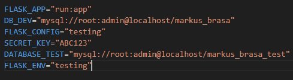

# Preparacion Ambiente de Trabajo
Para poder compilar el proyecto primero debes tener Python Instalado [Descarga Aqui](https://www.python.org/downloads/) la versión recomendada y usada en el proyecto es python 3.12.

Tambien se debe instalar MySQL y crear una base de datos llamado **markus_brasa**, para este caso se utiliza **markus_brasa_test** [Descarga MySQL](https://dev.mysql.com/downloads/installer/) y [MySQL Workbench](https://dev.mysql.com/downloads/workbench/)

Una vez instalado python y el proyecto descargado, deberas de utilizar el siguiente comando:
```
pip install virtualenv
```
Este paquete nos permitira crear ambientes virtuales de trabajo, luego utilizamos
```
virtualenv env
```
Para poder crear la carpeta de env donde se guardara los nuevos paquetes a instalar, para poder activar este ambiente virtual deberas de utilizar, en la terminal:
``` 
.\env\Scripts\activate
```

Previo a realizar la instalacion de requerimientos porfavor descargar el siguiente archivo:
[MariaDB-Connector](https://drive.google.com/file/d/1RcZMn_kwakQYDTb1bFujuAs7aIHxnsIO/view?usp=sharing), teniendo esto ya descargado porfavor mover el archivo descomprimido a la ruta C:\ , esto se da debido para realizar una conexion con la base de datos nos pide descargar archivos de conexion previos, si el error persiste buscar en stackoverflow con el error copiado, se encontrara de forma facil una solucion.


Una vez activada el ambiente virtual utilizamos,esto descargara todos los paquetes necesarios para compilar:
```
pip install -r requirements.txt
```
Recordar para poder realizar esta compilación debes de tener:

* Mysql instalado previamente
* IDE ( Visual Studio(recomendacion) )
* Python 3.12
* Crear un archivo .env el cual contenga estos datos:

    

Teniendo todos los requisitos previos recordar crear un Schema o Database llamado **markus_brasa**, para poder compilar las versiones de migrations:

> Habiendo creado la base de datos en Mysql **markus_brasa**, utilizar el siguiente comando:
```
flask db upgrade
```
Teniendo todos los upgrade previos de la base de datos podras utilizar:
```
flask run
```
De esta manera ya podras correr el proyecto y tener acceso a las rutas JSON.
